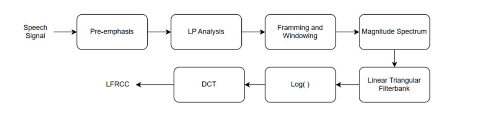

<h1 align="center">AI-Based-Spoof-Detection</h1>

  <h4>AI-based audio deepfake and spoof detection using LFRCC and TDNN.</h4> 
 

# Overview

This project focuses on detecting deepfake and spoofed audio using advanced speech processing and deep learning techniques. The proposed system uses Order-Optimized Linear Frequency Residual Cepstral Coefficients (LFRCC) along with a Time Delay Neural Network (TDNN) classifier to distinguish between genuine and manipulated speech signals.

The system is designed to identify subtle artifacts introduced by:
- Deepfake speech synthesis
- Replay attacks
- Voice conversion attacks

The proposed framework demonstrates strong robustness, low Equal Error Rate (EER), and high detection accuracy across benchmark datasets.

# Dataset Description

The project uses publicly available benchmark datasets for audio spoof and deepfake detection.

## FoR-Norm Dataset
- 195,000+ utterances
- Real and synthetic speech samples
- Used for training, validation, and testing

Dataset Link:
https://www.kaggle.com/datasets/mohammedabdeldayem/the-fake-or-real-dataset

## ASVspoof 2021 Dataset
- Benchmark dataset for spoof detection
- Includes multiple synthetic speech attacks

Dataset Link:
https://www.asvspoof.org/

Due to the large dataset size, datasets are not uploaded to this repository.

# Methodology

1. Audio preprocessing and normalization
2. Framing and windowing
3. LP residual extraction
4. LFRCC feature extraction
5. TDNN model training
6. Performance evaluation using Accuracy, F1-score, and EER

# Proposed Architecture

• The input audio signal is first preprocessed and segmented into frames.

• Linear Prediction (LP) analysis is applied to obtain the residual signal.

• LFRCC features are extracted from the LP residual signal.

• TDNN classifier is used for temporal modeling and spoof classification.

• The framework is optimized for robust and real-time spoof detection.

# Some Screenshots

• LP Residual Analysis  

• Spectrogram comparison of real vs fake speech  

• LFRCC Feature Extraction Architecture  

# Results

## Cross-Dataset Analysis

| Dataset Used | Accuracy | F1-score | EER |
| ----------- | ----------- | ----------- | ----------- |
| FOR-Original | 61.73% | 67.72% | 37.40% |
| ASVspoof 2021 | 62.63% | 57.11% | 58.14% |
| FOR-Norm | 97.65% | 97.65% | 2.35% |

## Comparison with LFCC and MFCC

| Feature Type | Accuracy | F1-Score | EER |
| ----------- | ----------- | ----------- | ----------- |
| MFCC | 67.67% | 67.67% | 15.30% |
| LFCC | 92.25% | 92.26% | 7.62% |
| LFRCC | 97.65% | 97.65% | 2.35% |

## Comparison with Deep Learning Models

| Model | Accuracy | F1-score | EER |
| ----------- | ----------- | ----------- | ----------- |
| Whisper 960(base) | 94.21% | 94.22% | 19.03% |
| Whisper 960(tiny) | 93.69% | 93.71% | 6.38% |
| Wav2Vec2(large) | 81.24% | 81.54% | 19.03% |
| Wav2Vec2(base) | 68.10% | 71.11% | 32.55% |
| TDNN | 97.65% | 97.65% | 2.35% |

# Noise Robustness Analysis

## Babble Noise Analysis (LFRCC)

| dB | Accuracy | F1-score | EER |
| ----------- | ----------- | ----------- | ----------- |
| 20 | 96.18% | 96.18% | 3.82% |
| 15 | 92.81% | 92.81% | 7.14% |
| 10 | 84.91% | 84.96% | 14.93% |
| 5 | 87.87% | 87.87% | 12.15% |
| 0 | 87.00% | 87.00% | 12.95% |

# Conclusion

The proposed LFRCC-based TDNN framework significantly outperformed conventional MFCC and LFCC approaches for audio deepfake detection.

The system achieved:
- High accuracy
- Low Equal Error Rate
- Strong robustness under noisy conditions
- Better cross-dataset generalization

This project demonstrates the effectiveness of residual-based speech feature extraction for real-world spoof detection systems.

# Technologies Used

- Python
- PyTorch
- Librosa
- NumPy
- Signal Processing
- Deep Learning
- Speech Processing

# Authors

- S.B. Hema Anjali
- CH. Samyana Reddy
- P. Nikhita Reddy
- P. Sree Varsha Reddy

# License

This project is licensed under the MIT License.
